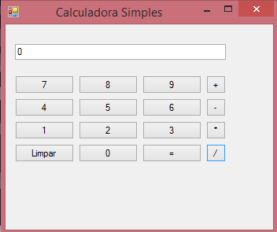

# :1234: Calculadoras


Este repositório contém duas calculadoras desenvolvidas na aula 02 do módulo Técnicas de Programação. <br/>
- A Calculadora de IMC foi desenvolvida durante a aula, de acordo com as orientações do professor.
- A Calculadora Simples foi desenvolvido como um dever de casa. Segue o enunciado.

### Enunciado
Crie uma calculadora conforme a imagem disponibilizada.<br/>
<p align="left">
  
</p>
<br/>

- Deve conter apenas as operações somar, subtrair, dividir e multiplicar.
- Para jogar os valores no TextBox, vá concatenando os mesmos na propriedade Text.
- Para realizar o cálculo de forma simples com conteúdo da TextBox, utilize o método Compute da classe DataTable. Ex.:

```C#
DataTable Calc = new DataTable();
var result = Calc.Compute("2+2", "");
```
## :hammer: Como executar o programa
Clonar o repositório em uma pasta local: `git clone https://github.com/sathyagimenes/TP.Aula02.Exercico.Calculadoras.git` <br/>
Abra a solução do projeto com o visual studio: arquivo `Calculadoras.sln` <br/>
Execute o projeto com `CTRL + F5`
